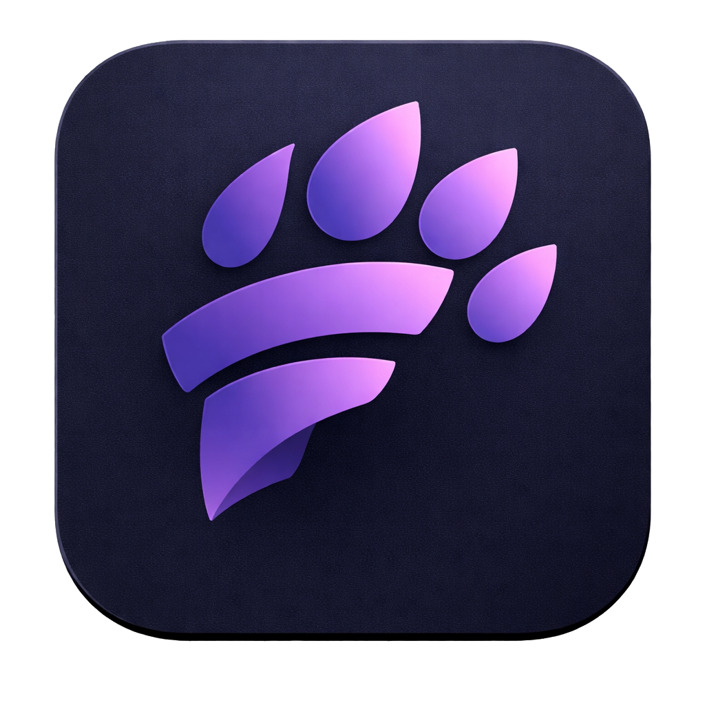

  <h1>Furya</h1>
  
  
  <h1>Fast. Modern. Powerful.</h1>
  

    <strong>The most advanced native Android client for e621.net</strong>
  

  

    
  

  

    
    
  

---

## What is Furya?

**Furya** is a native Android application built from the ground up to provide a superior browsing experience for the e621 image board. Unlike simple web-wrappers, Furya caches data intelligently, preloads content, and offers features that power-users need.

Whether you are browsing casually or managing large collections of favorites, Furya is designed to be **fast, fluid, and battery-friendly**.

---

## Key Features & Capabilities

### ⚡ Performance & Display
*   **Infinite Masonry Grid:** A staggered, Pinterest-style layout that adapts perfectly to your phone's aspect ratio.
*   **Zero-Lag Scrolling:** Aggressive prefetching ensures images are ready before you scroll to them.
*   **Customizable Layout:** Adjust the grid to show **1, 2, or 3 columns** via Settings.
*   **Theme Engine:** Fully supported **Dark Mode** (OLED black), Light Mode, and System Sync.

### 🎬 Universal Media Support
*   **HD Image Viewer:** Full support for `Deep Zoom` to inspect 8K+ art without blurring.
*   **Video Player:** Native playback for **WebM** and **MP4** files with looping and mute controls.
*   **Animations:** Smooth, optimized GIF playback.
*   **Flash (SWF) Support:** 
    *   Dedicated setting to **Show/Hide** Flash content in the grid.
    *   Secure "Open in Browser" bridge for legacy SWF files (compatibile with standard Android browsers).
    *   Visual indicators in the grid for SWF/WebM/GIF files.

### 💾 Offline Power-User Tools
*   **Smart Tag Cache:** 
    *   Downloads a local database of the top **15,000 tags**.
    *   Provides instant, offline-capable autocomplete for tags.
*   **Offline Favorites Sync:**
    *   Define specific tags (e.g., `wallpaper`, `fav:my_user`) to keep offline.
    *   **Auto-Sync:** The app downloads posts matching these tags to your device.
    *   **Storage Limits:** Set a custom cache limit (e.g., 500MB, 2GB) to manage storage usage.
*   **Sync Dashboard:** Monitor download progress and cache status directly in Settings.

### 🔍 Search & Discovery
*   **Intelligent Autocomplete:** Typing `fox`? We'll instantly suggest `fox_ears`, `red_fox`, etc., using the local tag database.
*   **Tag Grouping:** Tags are color-coded by category (Artist, Character, Species, Copyright) just like the main site.
*   **Search History:** Jump back to your previous queries instantly.
*   **Favorite Tags:** Pin your most-visited tags for one-tap access from the home screen.

### 🛡️ Privacy & Account
*   **Account Integration:** Log in securely to manage your remote favorites and vote on posts.
*   **Blacklist:** 
    *   Import your e621 account blacklist.
    *   Manage a local blacklist to hide specific content globally.
*   **Safe Mode:** Content filtering for Questionable/Explicit ratings.

---

## Support & Feedback

We use GitHub Issues to track bugs and feature requests.

### Found a Bug? 🐛
If the app crashes or behaves unexpectedly:
1.  Check if the bug is already reported in the [Issues](https://github.com/CyberByteCraft/Furya-Public/issues) tab.
2.  Open a **[Bug Report](https://github.com/CyberByteCraft/Furya-Public/issues/new?assignees=&labels=bug&template=bug_report.yml)**.
3.  Please provide your **device model** and **Android version** so we can reproduce it.

### Have an Idea? 🚀
We love hearing what you want next!
1.  Open a **[Feature Request](https://github.com/CyberByteCraft/Furya-Public/issues/new?assignees=&labels=enhancement&template=feature_request.yml)**.
2.  Describe the problem you are trying to solve and your proposed solution.

### Labels Guide
We use the following labels to organize issues:
*    **Bug**: Something isn't working.
*    **Enhancement**: A new feature request.
*    **Question**: General questions or discussions.
*    **UI/UX**: Visual or design topics.

---

## Installation Guide

1.  **Download:** Go to the **[Releases](https://github.com/CyberByteCraft/Furya-Public/releases/latest)** tab.
2.  **Get the APK:** Download `app-arm64-v8a-release.apk` (Best for 99% of phones) or `app-release.apk` (Universal).
3.  **Install:** Open the file. You may need to enable "Install from Unknown Sources" in your browser settings.

---

## Disclaimer

This application is a third-party client. It accesses public APIs provided by e621.net.
Furya is not affiliated with, endorsed by, or sponsored by e621.
Please browse responsibly.

---

